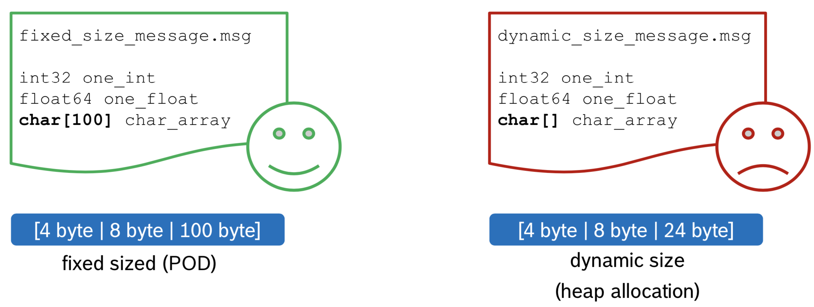
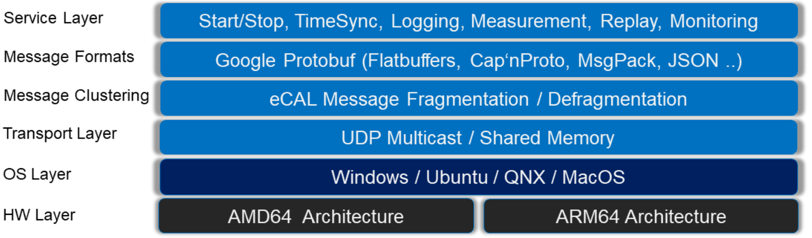

# Data Middleware-Platform for embedded systems (or autonomous projects)

The analysis, thoughts, and suggestions on message passing and data marshalling for autonomous vehicles in and between embedded platforms.

Related modules: ROS, LCM, iceoryx

* [ROS](https://www.ros.org/)
  - ROS provides the services you would expect from an operating system, including hardware abstraction, low-level device control, implementation of commonly-used functionality, message-passing between processes, and package management. It also provides tools and libraries for obtaining, building, writing, and running code across multiple computers. 
  - ROS has competitive **(and maybe the best) ecosystem** suits the research + quick demo needs well, with lots of visualization tools inside and tons of communities contributed components. 
  - But it's way too heavy for resource limited devices and it's not built for realtime purpose from the very beginning.
  - The non-realtime limitation is issued by plugins to replace the underlaying messaging middleware (iceoryx below is one of the choices).
  - The hungry resource demands may be lightening by partially installation like **ROS-Base: (Bare Bones)**.
  - The messages are **copied** when more than one peer try to subscribe them

* [ROS2](https://index.ros.org/doc/ros2/)
  - Since ROS was started in 2007, a lot has changed in the robotics and ROS community. The goal of the ROS 2 project is to adapt to these changes, leveraging what is great about ROS 1 and improving what isn’t.
  - ROS2 is new and promising, but not largely deployed and in nearby future may still won't be, as the evolving of new ecosystem will take long time and the main target users like autonomous companies may turn to RTOS systems like QNX directly.

* [LCM](https://lcm-proj.github.io/index.html)
  - LCM is a set of libraries and tools for message passing and data marshalling, **targeted at real-time systems** where high-bandwidth and low latency are critical.
  - LCM is light-weight, built on UDP, have publish/subscribe mechanism, messages can be easily logged for replaying.
  - LCM messages **may drop** when the network overload is too high, and multicast can be a burden (can be controlled by TTL).

* [iceoryx](https://github.com/eclipse/iceoryx)
  - iceoryx is brand-new player, open-sourced and maintained (mainly) by bosch's engineers.
  - iceoryx is an inter-process-communication (IPC) middleware. It has its origins in the automotive industry, where large amounts of data have to be transferred between different processes when it comes to driver assistance or automated driving systems. However, the efficient communication mechanisms can also be applied to a wider range of use cases, e.g. in the field of robotics or game development.
  - The ambition is aggressive, the demo codes are appealing and zero-copy is magic-word, it has the potential to be one great project.
  - Currently (2020.09), [the codebase is not stable yet and QNX support can be improved](https://github.com/eclipse/iceoryx/issues/287).
  - iceoryx runs on the same machine, not across network (that's how zero-copy is possible)

## Takeaways

Notes on these modules for adoption:

* [LCM usage](./lcm.md)

## Evaluations

### ROS on iceoryx

[rmw_iceoryx](https://github.com/ros2/rmw_iceoryx)

That being said, iceoryx can be used by ROS2, not ROS1. So, things can be tricky as porting existing projects to ROS2 itself can be not easy.

### iceoryx + LCM

iceoryx is well suited for IPC on the same machine, and LCM can be used for data recording + communications between machines

## Thoughts 

### Transferred POD msgs

> The plain old datatype (POD) on the left side is very well suited for zero copy data transport as its size is definitely defined (on compile time).

-- [data type suited for zero-copy](https://github.com/ros2/rmw_iceoryx)

So, we should try to use POD as much as possible, only turn to dynamic subbing if necessary.

## TODO

* [zcm](https://github.com/ZeroCM/zcm)
  - ZCM: Zero Communications and Marshalling, built upon lcm, may deserve having a look at.

* [ecal](https://github.com/continental/ecal)
  - Another data flow management tool like LCM, it's somehow more complicated as much more plugins/implements involved. But worth trying too.

